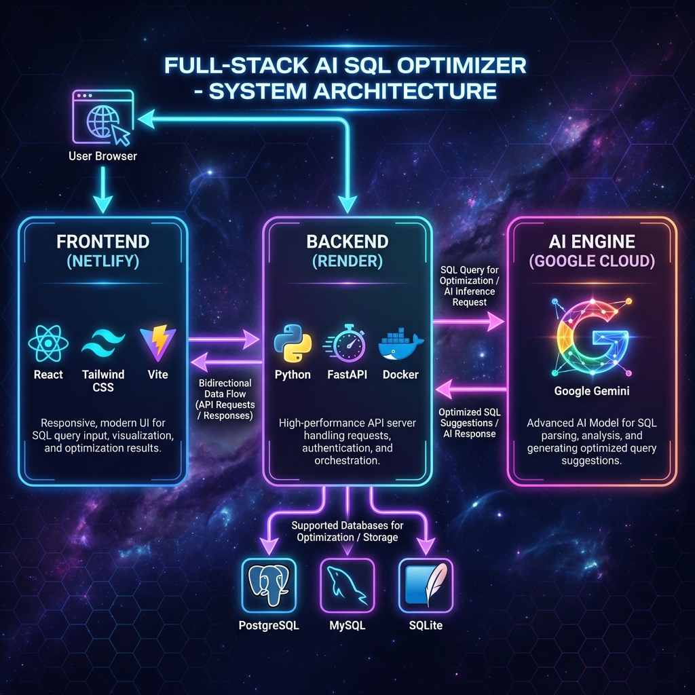

# 🚀 AI-Powered SQL Query Optimizer & Generator



[]()
[]()
[]()

A professional-grade database engineering tool that leverages **Google Gemini AI** to analyze SQL execution plans, identify bottlenecks, and generate optimized queries for **PostgreSQL**, **MySQL**, and **SQLite**.

---

## ✨ Features

### 🔍 Intelligent Optimization
*   **Static Analysis:** Identify full table scans, missing indexes, and `SELECT *` anti-patterns.
*   **AI Insights:** Uses `gemini-flash-latest` to act as an expert DBA, explaining *why* a query is slow.
*   **Dialect Aware:** Generates optimization advice specific to your database engine (Postgres vs MySQL).

### ✍️ Text-to-SQL Generator
*   **Natural Language:** "Find users who ordered last week" -> `SELECT ...`
*   **Schema Aware:** Injects your table definitions into the context to prevent hallucinations.
*   **Multi-Dialect:** Supports syntax for Postgres (`EXTRACT`), MySQL (`DATE_ADD`), and SQLite (`strftime`).

### 🛡️ Enterprise Ready
*   **Secure:** API Keys are handled via Environment Variables (never stored in code).
*   **Fail-Safe:** Graceful error handling with explicit feedback on Quota limits.
*   **Modern UI:** "Cosmic Dark" theme with glassmorphism, animations, and responsive design.

---

## 🚀 Quick Start

### Prerequisites
*   Node.js (v18+)
*   Python (v3.9+)
*   Google Gemini API Key ([Get one here](https://aistudio.google.com/))

### 1. Clone & Install
```bash
git clone https://github.com/sriiverse/AI-SQL-Optimizer.git
cd AI-SQL-Optimizer
```

### 2. Backend Setup
```bash
cd backend
pip install -r requirements.txt
# Create .env file (See .env.example)
echo "GEMINI_API_KEY=your_key_here" > .env
python main.py
```
*Server runs at `http://localhost:8000`*

### 3. Frontend Setup
```bash
cd frontend
npm install
npm run dev
```
*App runs at `http://localhost:5173`*

---

## 💡 Example Workflows

### Scenario 1: Optimizing a Slow Query
**Input:**
```sql
SELECT * FROM orders WHERE DATE(created_at) = '2023-01-01'
```
**AI Analysis:**
> *"Using a function like `DATE()` on a column prevents index usage (SARGable violation). This causes a Full Table Scan."*

**Optimized Output (PostgreSQL):**
```sql
SELECT * FROM orders 
WHERE created_at >= '2023-01-01 00:00:00' 
  AND created_at < '2023-01-02 00:00:00';
```

### Scenario 2: Generating Reports
**Question:** *"Show me top 5 customers by speed of payment"*
**Schema Context:** `payments (amount, date, customer_id)`, `customers (id, name)`
**AI Output:**
```sql
SELECT c.name, AVG(p.date - o.order_date) as avg_payment_speed
FROM customers c
JOIN payments p ON c.id = p.customer_id
GROUP BY c.id
ORDER BY avg_payment_speed ASC
LIMIT 5;
```

---

## 🔒 Privacy & Data Safety

This application sends data to **Google's Generative AI API**.
*   **What is sent:** The SQL Query, Table Schema, and Natural Language Question you provide.
*   **What is NOT sent:** Database credentials, connection strings, or actual row data (unless you paste row data into the schema box).
*   **Recommendation:** Use randomized/anonymized table names (e.g., `table_a`) if your schema contains highly sensitive trade secrets.

---

## 🏗️ System Architecture
The application follows a **Hybrid Cloud Architecture**:
*   **Frontend:** React (Vite) + Tailwind CSS + Framer Motion. Hosted on **Netlify**.
*   **Backend:** FastAPI (Python) running on **Render**.
*   **AI Engine:** **Google Gemini Flash**.

---

## 🛠️ Deployment
See the [Deployment Guide](./deployment_guide.md) for detailed instructions on deploying to **Render** and **Netlify**.


**A hybrid, intelligent SQL engineering tool that combines static analysis with the power of Google's Gemini Pro LLM.**

This application serves as a comprehensive "SQL Companion" for developers and data analysts, offering real-time query optimization suggestions and natural language to SQL generation.

## 🌟 Key Features

### 🧠 Hybrid AI Engine
The core of this project is its **resilient, fail-safe architecture**:
*   **Real AI Mode:** When a valid `GEMINI_API_KEY` is present, the system leverages **Google Gemini Pro** to perform deep, context-aware analysis of arbitrary queries and schemas.
*   **Demo Mode (Fail-Safe):** If the API key is missing or quota is exceeded, the system seamlessly degrades to a **Simulated Heuristic Engine**. This ensures the application *never* breaks and is always available for demonstration purposes.

### ⚡ Performance Optimizer
*   **Execution Plan Analysis:** Simulates/Retrieves `EXPLAIN ANALYZE` metrics (Cost, Rows, Node Types).
*   **Smart Suggestions:** Identifies common anti-patterns (e.g., `SELECT *`, Unbounded queries, Leading wildcards).
*   **Auto-Fix:** Generates optimized SQL rewrites instantly.

### 🗣️ Text-to-SQL Generator
*   **Natural Language Processing:** Translates plain English questions (e.g., *"Find top users by sales"*) into syntactically correct SQL.
*   **Schema-Aware:** Understands custom table definitions provided on the fly.

---

## 🛠️ Tech Stack

*   **Frontend:** React, TypeScript, Vite, Tailwind CSS, Framer Motion (for smooth UI/UX).
*   **Backend:** Python, FastAPI, Uvicorn, Google Generative AI (`google-generativeai`).
*   **Deployment:** designed for Render (Backend) and Netlify (Frontend).

---

## 🚀 Getting Started

### Prerequisites
*   Node.js & npm
*   Python 3.10+
*   Google Gemini API Key (Optional, for Real AI features)

### Local Setup

1.  **Clone the repository**
    ```bash
    git clone https://github.com/sriiverse/AI-SQL-Optimizer.git
    cd AI-SQL-Optimizer
    ```

2.  **Backend Setup**
    ```bash
    cd backend
    pip install -r requirements.txt
    
    # Optional: Enable Real AI
    # Create a .env file and add: GEMINI_API_KEY=your_key_here
    
    uvicorn main:app --reload
    ```

3.  **Frontend Setup**
    ```bash
    cd frontend
    npm install
    npm run dev
    ```

## ☁️ Deployment

### Backend (Render)
*   **Build Command:** `pip install -r requirements.txt`
*   **Start Command:** `uvicorn main:app --host 0.0.0.0 --port $PORT`
*   **Environment Variables:** `GEMINI_API_KEY` (Required for Real AI)

### Frontend (Netlify/Vercel)
*   **Build Command:** `npm run build`
*   **Output Directory:** `dist`
*   **Environment Variables:** `VITE_API_BASE_URL` (Point to your Render Backend URL)

---

## 📸 Screenshots
*(Add your screenshots here)*
